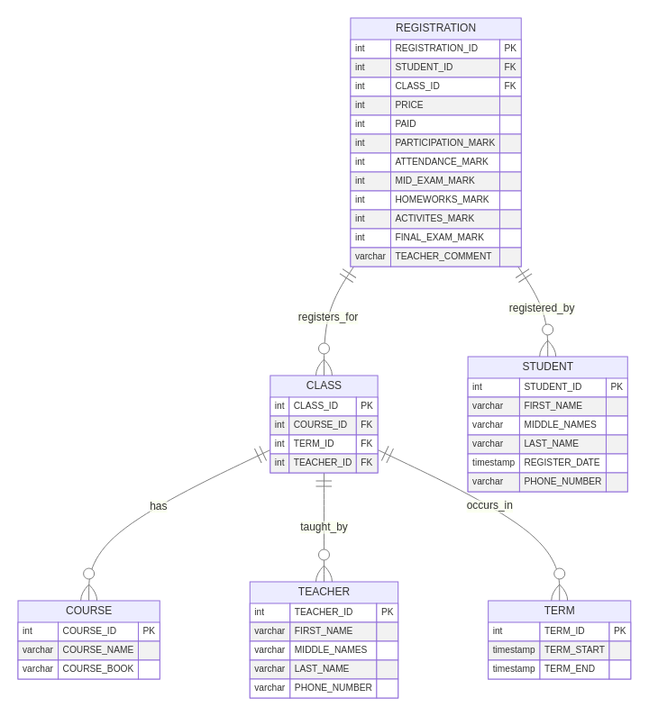

# 🌟 OEAMS Academic Management System

*A well designed solution for academic registration and management*

---

## 📝 Introduction

The **OEAMS Academic Management System** is a conceptual database-driven platform designed to support core academic operations within an educational institution. Built around a clear Entity-Relationship (ER) model, the system centralizes data for courses, students, teachers, terms, classes, and registrations—ensuring accuracy, efficiency, and scalability in academic administration.

---
## 📏 OEAMS Entity Relationship Diagram

___
## 🧩 Core Entities

| Entity       | Description |
|-------------|-----------|
| **Students** | Individuals enrolled in classes. Tracked via personal info and registration history. |
| **Teachers** | Faculty members assigned to teach classes. Managed with contact and teaching details. |
| **Courses**  | Academic subjects offered, each with a name and associated course book. |
| **Terms**    | Academic periods (e.g., Fall 2025) defined by start and end dates. |
| **Classes**  | Specific instances of a course taught in a term by a teacher. |
| **Registrations** | Records of student enrollment in a class, including fees and performance metrics. |

---

## 🔁 Key System Processes

### 1. **Term Management**
Administrators define academic terms with start/end dates to structure the academic calendar.

### 2. **Course Catalog**
Maintain an up-to-date list of available courses, including updates or deactivations.

### 3. **Teacher Management**
Store teacher information and assign them to classes per term based on availability and expertise.

### 4. **Class Scheduling**
Create classes by linking a course, term, and teacher—forming the academic schedule.

### 5. **Student Registration and Firing**
Allow students to enroll in available classes, recording fees and payment status.

### 6. **Performance Tracking**
Teachers record grades across multiple categories (attendance, exams, homework, etc.) and add feedback comments.

---

## 👥 System Users

| Role           | Responsibilities |
|----------------|------------------|
| **Administrators** | Manage terms, courses, teachers, and system-wide settings. |

---

## ✅ Benefits

- Centralized academic data  
- Clear relationships between entities  
- Support for grading, payments, and feedback  
- Scalable design for growing institutions  

---
> *Coded Sharply by Code Sharp Team*
---
